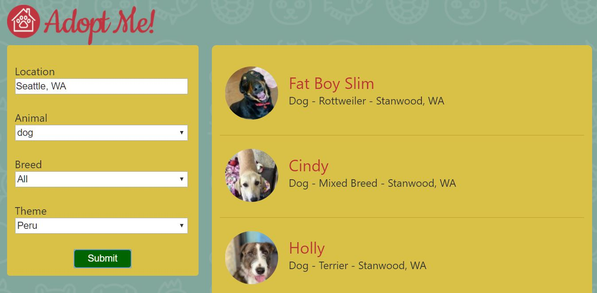
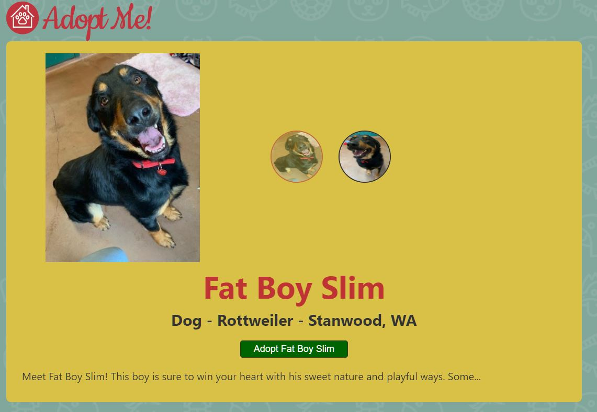

# React Course: Complete Intro To React V5

**React practice following [Brian Holt's course 'COMPLETE INTRO TO REACT V5'](https://frontendmasters.com/courses/complete-react-v5/)** (If you are a student, you can use [GitHub student pack](https://education.github.com/pack) to get a free 6-month subscription to Frontend master. The GitHub student pack provides lots of amazing resources!)



- **Topics covered**: basic React (functional & class components, props, one-way data binding, async), setup (ESLint, Prettier, Parcel, Babel for Parcel), React Hooks (useState, useEffect), API, Reach Router, Error Boundaries (& Redirect), React Context (to replace Redux), React Portals & React Portals (with modals)



- **Written Material**: https://btholt.github.io/complete-intro-to-react-v5/

- **GitHub**: https://github.com/btholt/complete-intro-to-react-v5

---

## Setup

##### You can use React with CDN in your html file with script tag:

(Of course you can also install React & React-Dom as npm packages)

```html
<script src="https://unpkg.com/react@16.8.4/umd/react.development.js"></script>
<script src="https://unpkg.com/react-dom@16.8.4/umd/react-dom.development.js"></script>
```

##### How to set up Parcel

- Parcel: https://www.npmjs.com/package/parcel

1. npm install -D parcel-bundler

2. write script in package.json '"dev": "parcel src/index.html"'

3. Parcel will install npm packages for you.

For example, type in the following line in your .js file. If you check your terminal, you will see that Parcel is installing this package for you.

```javascript
import { Router } from "@reach/router";
```

##### How to set up ESLint (.eslintrc.json)

```javascript
{
  "extends": [
    "eslint:recommended",
    "plugin:import/errors",
    "plugin:react/recommended",
    "plugin:jsx-a11y/recommended",
    "prettier",
    "prettier/react"
  ],
  "rules": {
    "react/prop-types": 0
  },
  "plugins": ["react", "import", "jsx-a11y"],
  "parserOptions": {
    "ecmaVersion": 2018,
    "sourceType": "module",
    "ecmaFeatures": {
      "jsx": true
    }
  },
  "env": {
    "es6": true,
    "browser": true,
    "node": true
  },
  "settings": {
    "react": {
      "version": "detect"
    }
  }
}
```

##### How to enable experimental syntax 'classProperties' (Configure Babel for Parcel)

1. Install npm packages

```
npm install -D babel-eslint @babel/core @babel/preset-env @babel/plugin-proposal-class-properties @babel/preset-react
```

2. Configure .babelrc

```javascript
{
  "presets": ["@babel/preset-react", "@babel/preset-env"],
  "plugins": ["@babel/plugin-proposal-class-properties"]
}
```

3. Configure .eslintrc.json

4) After that you can use 'classProperties' syntax in src\Details.js

```javascript
class Details extends React.Component {
  //   constructor(props) {
  //     super(props);
  //     this.state = {
  //       loading: true
  //     };
  //   }

  state = { loading: true };
```

---

## Props

##### React.createElement arguments

```javascript
const App = () => {
  return React.createElement(
    "div", // 1st - HTML tags
    {}, // 2nd - { class: "this-is-a-class" }: attribute that you wanna give to the component
    React.createElement(
      // 3rd - children that you wanna pass into the element
      "h1",
      {},
      "Adopt Me!"
    )
  );
};
```

##### Passing props

```javascript
const Pet = (props) => {  // Props are variables that a parent (App) passes to its children (the instances of Pet.)
    return React.createElement(
        "div", {}, [
        React.createElement("h1", {}, props.name),
        React.createElement("h2", {}, props.animal),
        React.createElement("h2", {}, props.breed)
    ]
    )
}

const App = () => {  // Parent
//...
            React.createElement(Pet, { name: "Hunter", animal: "dog", breed: "husky" }), // Children
            React.createElement(Pet, { name: "Bruno", animal: "cat", breed: "mixed" }),
            React.createElement(Pet, { name: "Naggy", animal: "bird", breed: "cockatoo" }),
        ]
    )
}
```

##### Destructuring props

```javascript
const Pet = ({ name, animal, breed }) => {
  return React.createElement("div", {}, [
    React.createElement("h1", {}, name),
    React.createElement("h2", {}, animal),
    React.createElement("h2", {}, breed)
  ]);
};
```

##### Passing props in JSX (with destructuring)

```javascript
// app.js
return (
  <div>
    <h1>Adopt Me!</h1>
    <Pet name="Hunter" animal="dog" breed="husky" />
    <Pet name="Burno" animal="cat" breed="mixed" />
    <Pet name="Naggy" animal="bird" breed="cockatoo" />
  </div>
);

// pet.js
export default function Pet({ name, animal, breed }) {
  return (
    <div>
      <h1>{name}</h1>
      <h2>{animal}</h2>
      <h2>{breed}</h2>
    </div>
  );
}
```

##### A way to see props that were passed into your router in DOM

src\Details.js

```javascript
const Details = props => {
  return (
    <pre>
      <code>{JSON.stringify(props, null, 4)}</code>
    </pre>
  );
};
```

If you enter 'http://localhost:1234/details/2' in browser, you will see:

```
{
    "path": "/details/:id",
    "id": "2",
    "uri": "/details/2",
    "location": {
        "pathname": "/details/2",
        "search": "",
        "hash": "",
        "href": "http://localhost:1234/details/2",
        "origin": "http://localhost:1234",
        "protocol": "http:",
        "host": "localhost:1234",
        "hostname": "localhost",
        "port": "1234",
        "state": null,
        "key": "initial"
    }
}
```

---

## React Hooks

- Can only be used with functional components (i.e. You cannot use it with class components)

- **useState**: https://reactjs.org/docs/hooks-reference.html#usestate
  const [state, setState] = useState(initialState);
- !!!Hooks rely on this strict ordering!!!: Don't use hooks inside any loops, if/else statement

```javascript
import React, { useState } from "react";

const SearchParams = () => {
  const [location, setLocation] = useState("Seattle, WA");
  // location is the current state (of location)
  // setLocation is a function that update a piece of the state
  // "Seattle, WA" is the initial state
  // useState creates the React Hook

  return (
    // ...
    <input
      id="location"
      value={location}
      placeholder="Please enter location"
      onChange={event => setLocation(event.target.value)}
    />
    // ...
  );
};
```

- **useEffect**: https://reactjs.org/docs/hooks-effect.html
  If you’re familiar with React class lifecycle methods, you can think of useEffect Hook as componentDidMount, componentDidUpdate, and componentWillUnmount combined.

src\SearchParams.js

```javascript

import React, { useState, useEffect } from "react";
import pet, { ANIMALS } from "@frontendmasters/pet";
import useDropdown from "./useDropdown";

const SearchParams = () => {
  // !!!Order of 'useState' is critical!!!

  // [[[[Initial render]]]]
  const [location, setLocation] = useState("Seattle, WA");
  const [breeds, setBreeds] = useState([]);
  const [animal, AnimalDropdown] = useDropdown("Animal", "dog", ANIMALS);
  // const [animal, setAnimal] = useState("dog");
  // "Animal"(label), "dog"(defaultState), ANIMALS(options)
  const [breed, BreedDropdown, setBreed] = useDropdown("Breed", "", breeds);
  // const [breed, setBreed] = useState("");

  // [[[[After the initial render, we call the side effects here]]]]
  useEffect(() => {
    setBreeds([]); // When we change animal, the breeds array will be set as an empty array
    setBreed(""); // and the breed we selected will be changed to empty string

    pet.breeds(animal).then(({ breeds: apiBreeds }) => {
      const breedStrings = apiBreeds.map(({ name }) => name); // Destructure name from the breeds object
      setBreeds(breedStrings);
    }, console.error);
  }, [animal, setBreed, setBreeds]); // dependencies, if any of these changed, then re-render

//...
```

---

## One-way Data Flow

src\app.js

```javascript
import SearchParams from "./SearchParams";

const App = () => {
  return (
    <div>
      <h1>Adopt Me!</h1>
      <SearchParams />
    </div>
  );
};
```

src\SearchParams.js

```javascript
import Results from "./Results";

<Results pets={pets} />;
```

src\Results.js

```javascript
import Pet from "./Pet";

const Results = ({ pets }) => {
  return (
    <div className="search">
      {pets.length === 0 ? (
        <h1>No Pets Found</h1>
      ) : (
        pets.map(pet => (
          <Pet
            animal={pet.type}
            key={pet.id}
            name={pet.name}
            breed={pet.breeds.primary}
            media={pet.photos}
            location={`${pet.contact.address.city}, ${pet.contact.address.state}`}
            id={pet.id}
          />
        ))
      )}
    </div>
  );
};
```

src\Pet.js

```javascript
export default function Pet({ name, animal, breed, location }) {
  return (
    <div>
      <h1>{name}</h1>
      <h2>Animal: {animal}</h2>
      <h2>Breed: {breed}</h2>
      <h2>Location: {location}</h2>
    </div>
  );
}
```

---

## Reach Router

- Reach Router: https://www.npmjs.com/package/@reach/router
- Reach Router Docs: https://reach.tech/router

**Difference between 'React-Router' and 'Reach-Router':**

1. 'React-Router' will render everything that matches, while 'Reach-Router' will only render the thing that 'matches the most'.

2. In 'Reach-Router', order doesn't really matter, as 'Reach-Router' is rendered by a 'scoring system.

3. In 'Reach-Router', you can have multiple routes on the same page.

src\app.js

```javascript
<Router>
  <SearchParams path="/" />
  <AnotherRoute path="/details/1" />
  <Details path="/details/id" />
</Router>

// 'React-Router' will render both <AnotherRoute> & <Details>
// while 'Reach-Router' will only render <AnotherRoute> as it's more specific
```

---

## Class Components

- componentDidMount is a function that's called after the first rendering is completed. This pretty similar to a useEffect call that only calls the first time. This is typically where you want to do data fetching.

---

## Error Boundaries & Redirect

- Usage: componentDidCatch, static getDerivedStateFromError, componentDidUpdate (how you react to state and prop changes with class components)

- React Hooks can't deal with error boundaries (one of the reasons that we still need class components)

- Error boundaries are React components that catch JavaScript errors anywhere in their child component tree, log those errors, and display a fallback UI instead of the component tree that crashed: https://reactjs.org/docs/error-boundaries.html

- Why we need to wrap Details.js in ErrorBoundary.js: A component can only catch errors in its children. It cannot catch its own errors.

src\ErrorBoundary.js

```javascript
class ErrorBoundary extends Component {
  state = { hasError: false, redirect: false };

  static getDerivedStateFromError() {
    return { hasError: true };
  }

  componentDidCatch(error, info) {
    console.error("ErrorBoundary caught an error", error, info);
  }

  componentDidUpdate() {
    // similar to useEffect: will run every time props or state changes
    if (this.state.hasError) {
      setTimeout(() => this.setState({ redirect: true }), 5000);
    }
  }

  render() {
    // Order is important here!
    if (this.state.redirect) {
      return <Redirect to="/" />;
    }

    if (this.state.hasError) {
      return (
        <h1>
          There was an error with this listing. <Link to="/">Click here</Link>{" "}
          to go back to the home page or wait for 5 seconds.
        </h1>
      );
    }
    return this.props.children;
  }
}
```

- src\Details.js

```javascript
import ErrorBoundary from "./ErrorBoundary";

class Details extends React.Component {
  // Create a higher order component
export default function DetailsWithErrorBoundary(props) {
  // ...
  return (
    <ErrorBoundary>
      <Details {...props} /> {/* Use spread operator to spread props */}
    </ErrorBoundary>
  );
}
```

---

## React Context (replace Redux)

- Context: application-level state.
- createContext: a function that returns an object with two React components in it: a Provider and a Consumer.
- Provider: how you scope where a context goes. A context will only be available inside of the Provider. You only need to do this once.
- Consumer: how you consume from the above provider. A Consumer accepts a function as a child and gives it the context which you can use. We won't be using the Consumer directly: a function called useContext will do that for us.
- useContext is how you get the context data out of a given context

**React Context: React Hooks**

- src\ThemeContext.js

```javascript
import { createContext } from "react";

const ThemeContext = createContext(["blue", () => {}]);
// We put a hook [state, stateUpdater func] in the context

export default ThemeContext;
```

- src\app.js

```javascript
import { useState } from "react";
import ThemeContext from "./ThemeContext";
const App = () => {
  const themeHook = useState("darkgreen");
  return (
    <ThemeContext.Provider value={themeHook}>
      <div>
        <header>
          <Link to="/">Adopt Me!</Link>
        </header>

        <Router>
          <SearchParams path="/" />
          <Details path="/details/:id" />
        </Router>
      </div>
    </ThemeContext.Provider>
  );
};
```

- src\SearchParams.js

```javascript
import React, { useContext } from "react";
import ThemeContext from "./ThemeContext";
const SearchParams = () => {
  const [theme] = useContext(ThemeContext);
  // ...
  return (
    // ...
    <button style={{ backgroundColor: theme }}>Submit</button>
  );
};
```

**React Context: React Hooks**

- src\Details.js

```javascript
import ThemeContext from "./ThemeContext";

return (
  <ThemeContext.Consumer>
    {/* {themeHook => (
              <button style={{ backgroundColor: themeHook[0] }}>
                Adopt {name}
              </button>
            )} */}

    {/* Same as the above but used destructuring */}
    {([theme]) => (
      <button style={{ backgroundColor: theme }}>Adopt {name}</button>
    )}
  </ThemeContext.Consumer>
);
```

---

## React Portals & Refs

- Portal: a separate mount point (the actual DOM node which your app is put into) for your React app.

- The most common use case for React Portal is modals. You'll have your normal app with its normal mount point and then you can also put different content into a separate mount point (like a modal or a contextual nav bar) directly from a component.

- The nice thing about portals is that despite the actual elements being in different DOM trees, these are in the same React trees, so you can do event bubbling up from the modal.

- src\index.html (go into index.html and add a separate mount point)
  This where the modal will actually be mounted whenever we render to this portal. Totally separate from our app root.

```javascript
<body>
  <div id="modal"></div>
  <div id="root">not rendered</div>
  <script src="app.js"></script>
</body>
```

- src\Modal.js

1. This will mount a div and mount inside of the portal whenever the Modal is rendered and then remove itself whenever it's un-rendered.

2. useEffect: if you need to clean up after you're done (we need to remove the div once the Modal is no longer being rendered) you can return a function inside of useEffect that cleans up.

3. ref via the hook useRef: Refs are like instance variables for function components. (Whereas on a class you'd say this.myVar to refer to an instance variable, with function components you can use refs.) They're containers of state that live outside a function's closure state which means anytime I refer to elRef.current, it's always referring to the same element. This is different from a useState call because the variable returned from that useState call will always refer to the state of the variable when that function was called. It seems like a weird hair to split but it's important when you have async calls and effects because that variable can change and nearly always you want the useState variable, but with something like a portal it's important we always refer to the same DOM div; we don't want a lot of portals.

4. createPortal: to pass the children (whatever you put inside "Modal") to the portal div.

```javascript
import React, { useEffect, useRef } from "react";
import { createPortal } from "react-dom";

const Modal = ({ children }) => {
  const elRef = useRef(null);
  if (!elRef.current) {
    const div = document.createElement("div");
    elRef.current = div;
  }

  useEffect(() => {
    const modalRoot = document.getElementById("modal");
    modalRoot.appendChild(elRef.current);

    return () => modalRoot.removeChild(elRef.current);
  }, []);

  return createPortal(<div>{children}</div>, elRef.current);
};

export default Modal;
```

- src\Details.js

```javascript
import { navigate } from "@reach/router";
import Modal from "./Modal";
class Details extends React.Component {
  state = { loading: true, showModal: false };


    pet.animal(this.props.id).then(({ animal }) => {
      this.setState({
        url: animal.url,

      });
    }, console.error);
  }
    toggleModal = () => this.setState({ showModal: !this.state.showModal });
  adopt = () => navigate(this.state.url);

      const {

      showModal
    } = this.state;

    return (
          <ThemeContext.Consumer>

            {([theme]) => (
              <button
                onClick={this.toggleModal}
                style={{ backgroundColor: theme }}
              >
                Adopt {name}
              </button>
            )}
          </ThemeContext.Consumer>
                 <p>{description}</p>
          {showModal ? (
            <Modal>
              <div>
                <h1>Would you like to adopt {name}?</h1>
                <div className="buttons">
                  <button onClick={this.adopt}>Yes</button>
                  <button onClick={this.toggleModal}>No, I am a monster</button>
                </div>
              </div>
            </Modal>
          ) : null}
        </div>
      </div>
    );
  }
}

```

<!-- ```javascript
```

```javascript
```

```javascript
```

```javascript
```

```javascript
```

```javascript
```

```javascript
``` -->
